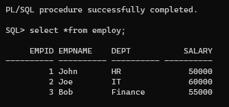

# <p align="center"> Ex. No: 4 Creating Procedures using PL/SQL</p>
### DATE: 05/09/23
## Aim: 
To create a procedure using PL/SQL.

## Algorithm:
1. Create employee table with following attributes (empid NUMBER, empname VARCHAR(10), dept VARCHAR(10),salary NUMBER);
2. Create a procedure named as insert_employee data.
3. Inside the procdure block, write the query for inserting the values into the employee table.
4. End the procedure.
5. Call the insert_employee data procedure to insert the values into the employee table.
6. Display the employee table

## Program:
```sql
create table employ( empid number,empname varchar(10),dept varchar(10),salary number);

CREATE OR REPLACE PROCEDURE insert_employ_data AS
BEGIN

INSERT INTO employ (empid,empname,dept,salary) VALUES (1,'John','HR',50000);

INSERT INTO employ (empid,empname,dept,salary) VALUES (2,'Joe','IT',60000);

INSERT INTO employ (empid,empname,dept,salary) VALUES (3,'Bob','Finance',55000);

COMMIT;

FOR emp_rec IN (SELECT * FROM employ) LOOP
DBMS_OUTPUT.PUT_LINE('Employee ID: ' || emp_rec.empid || ',Employee Name: ' || emp_rec.empname || ', Department: ' || emp_rec.dept || ', Salary:' || emp_rec.salary);
END LOOP;
END;
/
BEGIN
    insert_employ_data;
    END;
    /
select *from employ;
```
## Output:

## Result:
   Thus, procedure is created using PL/SQL.
